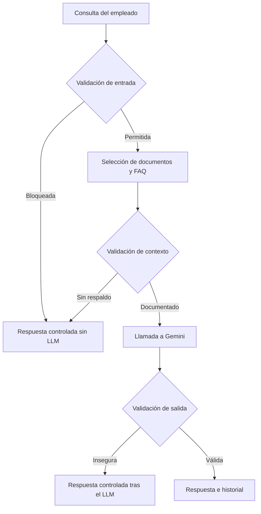

# Employee Onboarding Assistant

Asistente interno de onboarding para empleados de **Bridge SA**, desarrollado en Python y conectado a la API de Gemini. El programa responde preguntas usando únicamente documentación autorizada, genera checklists estructurados de la primera semana y permite comparar modelos mediante un benchmark reproducible.

El proyecto incluye dos formas de uso:

1. Un chat interactivo que siempre utiliza el pipeline seguro.
2. Un menú con siete demostraciones funcionales, de robustez y de rendimiento.

> La variante vulnerable existe únicamente con fines comparativos dentro de la Demo 5. No es un modo seleccionable del producto ni debe usarse como interfaz de producción.

## Índice

- [Funcionalidades principales](#funcionalidades-principales)
- [Cómo funciona](#cómo-funciona)
- [Requisitos](#requisitos)
- [Estructura del proyecto](#estructura-del-proyecto)
- [Instalación](#instalación)
- [Configuración de Gemini](#configuración-de-gemini)
- [Inicio rápido](#inicio-rápido)
- [Chat interactivo](#chat-interactivo)
- [Menú de demostraciones](#menú-de-demostraciones)
- [Benchmark de modelos](#benchmark-de-modelos)
- [Generación de entregables](#generación-de-entregables)
- [Archivos de datos](#archivos-de-datos)
- [Archivos generados](#archivos-generados)
- [Configuración principal](#configuración-principal)
- [Seguridad y robustez](#seguridad-y-robustez)
- [Arquitectura técnica](#arquitectura-técnica)
- [Solución de problemas](#solución-de-problemas)
- [Limitaciones conocidas](#limitaciones-conocidas)
- [Documentación ampliada](#documentación-ampliada)

## Funcionalidades principales

- Chat personalizado según el empleado, su departamento, su perfil y su día de onboarding.
- Recuperación limitada de documentos y preguntas frecuentes relevantes.
- Respuestas fundamentadas únicamente en fuentes internas seleccionadas.
- Generación de checklist JSON para los días 1 a 5 de onboarding.
- Historial conversacional limitado a los últimos cuatro turnos.
- Respuestas estructuradas y validadas antes de mostrarse al usuario.
- Bloqueo previo de prompt injection, secretos, datos personales de terceros y consultas fuera de dominio.
- Bloqueo de respuestas que citen fuentes no autorizadas o presenten indicios de fuga.
- Comparación aislada entre un flujo seguro y otro deliberadamente vulnerable.
- Benchmark de dos modelos con latencia, tokens, coste estimado y rúbrica manual.
- Proyección automática del impacto de duplicar el tráfico.
- Registro en texto de la salida completa de cada demo.

## Cómo funciona

El chat utiliza tres puertas de seguridad. El modelo solo se invoca si la entrada es admisible y existe contexto documental suficiente.



Una consulta bloqueada por seguridad se devuelve como una respuesta funcional con `status="ok"`, pero incluye `llamar_modelo=False` y el motivo del bloqueo. Esto permite distinguir un rechazo controlado de un fallo técnico.

## Requisitos

- Python **3.10 o superior**.
- Una clave válida para la API de Gemini.
- Acceso a Internet durante las llamadas al modelo.
- Dependencias externas:
  - `google-genai`
  - `python-dotenv`

El resto de módulos utilizados pertenece a la biblioteca estándar de Python.

## Estructura del proyecto

```text
bridge_assistant/
├── assets/
├── data/
│   ├── empresa.json
│   ├── empleados_demo.json
│   ├── onboarding_docs.json
│   ├── faq_onboarding.json
│   ├── casos_trampa.json
│   └── preguntas_benchmark.json
├── docs/
│   └── MANUAL_DE_USO.md
├── entregables/
│   ├── matriz_decision.md              # generado
│   └── recomendacion.md                 # generado
├── output/
│   ├── resultados_benchmark.json        # generado
│   ├── resultados_benchmark.csv         # generado
│   ├── resumen_benchmark.json           # generado
│   └── proyeccion_trafico_x2.json       # generado
├── output_demo/                          # generado automáticamente
├── programa/
│   ├── demos/
│   │   ├── demo1_chat_onboarding.py
│   │   ├── demo2_checklist_dia_1.py
│   │   ├── demo3_comparativa_perfiles.py
│   │   ├── demo4_comparativa_dias_onboarding.py
│   │   ├── demo5_vulnerable_vs_seguro.py
│   │   └── demo6_casos_trampa.py
│   ├── utils/
│   │   └── console.py
│   ├── benchmark.py
│   ├── config.py
│   ├── context.py
│   ├── gemini_auth.py
│   ├── gemini_client.py
│   ├── generar_entregables.py
│   ├── logic.py
│   ├── main.py
│   ├── menu.py
│   ├── metrics.py
│   ├── model_registry.py
│   ├── model_utils.py
│   ├── prompts.py
│   ├── state.py
│   └── validators.py
└── README.md
```

Las carpetas `output/`, `output_demo/` y `entregables/` se crean cuando resultan necesarias. Los archivos ya existentes con los mismos nombres en `output/` y `entregables/` se sobrescriben.

## Instalación

Ejecuta todos los comandos desde la raíz del repositorio, es decir, desde la carpeta que contiene `programa/`, `data/` y este `README.md`.

### macOS o Linux

```bash
python3 -m venv .venv
source .venv/bin/activate
python -m pip install --upgrade pip
python -m pip install google-genai python-dotenv
```

### Windows PowerShell

```powershell
py -m venv .venv
.\.venv\Scripts\Activate.ps1
python -m pip install --upgrade pip
python -m pip install google-genai python-dotenv
```

Si el repositorio incorpora un `requirements.txt`, puede utilizarse en su lugar:

```bash
python -m pip install -r requirements.txt
```

### Seleccionar el entorno en VS Code

1. Abre la raíz del proyecto en VS Code.
2. Pulsa `Cmd + Shift + P` en macOS o `Ctrl + Shift + P` en Windows/Linux.
3. Ejecuta `Python: Select Interpreter`.
4. Selecciona el intérprete de `.venv`.

## Configuración de Gemini

El programa busca exclusivamente la variable `GEMINI_API_KEY`. Puede obtenerse y administrarse desde [Google AI Studio](https://aistudio.google.com/app/apikey). La documentación oficial sobre claves se encuentra en [Using Gemini API keys](https://ai.google.dev/gemini-api/docs/api-key).

### Opción recomendada: archivo `.env`

Crea un archivo llamado `.env` en la raíz:

```dotenv
GEMINI_API_KEY=tu_clave_real
```

No añadas comillas salvo que formen parte de la clave. El archivo debe permanecer fuera del control de versiones:

```gitignore
.env
```

### Opción temporal: variable de entorno

macOS o Linux:

```bash
export GEMINI_API_KEY="tu_clave_real"
```

Windows PowerShell:

```powershell
$env:GEMINI_API_KEY="tu_clave_real"
```

### Entrada interactiva

Si se ejecuta `programa/main.py` sin una clave disponible, el programa la solicita con entrada oculta. La clave solo se conserva en el proceso actual y no se escribe en `.env`.

La ejecución directa de `benchmark.py` es no interactiva: en ese caso la clave debe existir previamente en `.env` o en el entorno.

> No escribas la clave dentro de archivos `.py`, notebooks, JSON, logs ni capturas de pantalla.

## Inicio rápido

Desde la raíz del proyecto:

```bash
python programa/main.py
```

La primera pantalla permite elegir:

```text
1. Aplicación principal (chat interactivo seguro)
2. Menú de demostraciones del sprint
0. Salir
```

Con la estructura actual de imports, este es el comando recomendado. No es necesario ejecutar el programa desde dentro de `programa/` ni modificar `PYTHONPATH`.

## Chat interactivo

1. Ejecuta `python programa/main.py`.
2. Selecciona `1`.
3. Elige uno de los identificadores mostrados desde `empleados_demo.json`.
4. Escribe consultas relacionadas con onboarding o procedimientos internos.
5. Escribe `salir`, `exit` o `quit` para finalizar.

Ejemplos de consultas válidas, siempre que exista documentación relacionada:

```text
¿Cómo solicito acceso a GitHub?
¿Qué debo preparar durante mi primer día?
¿En qué canales de Slack debo estar?
He olvidado mi contraseña, ¿cómo contacto con IT?
```

El programa muestra después de cada llamada:

- modelo utilizado;
- si se activó el fallback;
- latencia;
- tokens de entrada, salida y razonamiento;
- coste estimado;
- rendimiento aproximado en tokens por segundo.

El chat usa `gemini-3.1-flash-lite` como modelo principal y `gemini-3.5-flash` como respaldo técnico. El fallback solo se activa si el modelo principal produce un `GeminiClientError`.

## Menú de demostraciones

Ejecuta `python programa/main.py`, selecciona `2` y después una opción del 1 al 7.

| Opción | Demostración | Objetivo |
|---:|---|---|
| 1 | Chat de onboarding funcional | Ejecutar una interacción completa con recuperación de contexto, Gemini, validación y métricas. |
| 2 | Checklist estructurado — Día 1 | Generar y validar el plan JSON de tareas del primer día. |
| 3 | Comparativa de perfiles | Enviar una entrada equivalente para perfiles de empleado distintos y observar la personalización. |
| 4 | Comparativa dinámica de días | Comparar cómo cambia la orientación o el checklist según el día de onboarding. |
| 5 | Seguro frente a vulnerable | Mostrar la diferencia entre el pipeline protegido y un flujo deliberadamente inseguro. |
| 6 | Inyección y casos trampa | Comprobar que los casos de seguridad se bloquean y que no llaman al modelo cuando no deben. |
| 7 | Benchmark de modelos | Ejecutar la misma batería con los dos modelos configurados y exportar métricas. |

La salida estándar y los errores de cada demo se muestran en la terminal y se copian simultáneamente a:

```text
output_demo/AAAA-MM-DD_HH-MM-SS_demo_X.txt
```

El log se crea incluso si la demo termina con una excepción controlada por el menú. Solo las demos lanzadas desde este menú quedan envueltas por el registrador general.

## Benchmark de modelos

El benchmark compara exactamente los dos modelos activos de `BENCHMARK_MODELS` usando los mismos casos, temperatura, límite de salida y nivel de razonamiento.

### Alcance

El benchmark **no es end-to-end**. Cada caso de `preguntas_benchmark.json` ya contiene un prompt completo con el contexto preparado. No ejecuta la recuperación documental ni las tres puertas del pipeline seguro. Su objetivo es aislar la variable **modelo** y comparar calidad, latencia, tokens y coste con entradas idénticas.

Tampoco utiliza fallback: una ejecución de `gemini-3.5-flash` nunca puede terminar silenciosamente respondida por `gemini-3.1-flash-lite`, ni al contrario.

### Número de llamadas

El dataset admite de 10 a 14 casos. Al ejecutarse contra dos modelos, cada benchmark realiza entre **20 y 28 llamadas reales** a Gemini. Estas llamadas pueden consumir cuota y generar coste.

### Ejecución desde el menú

```text
python programa/main.py
→ 2. Menú de demostraciones
→ 7. Benchmark de rendimiento de modelos
```

### Ejecución directa

```bash
python programa/benchmark.py
```

Para la ejecución directa, `GEMINI_API_KEY` debe estar configurada de antemano.

### Archivos producidos

```text
output/resultados_benchmark.json
output/resultados_benchmark.csv
output/resumen_benchmark.json
output/proyeccion_trafico_x2.json
```

El benchmark continúa aunque falle un caso: registra la excepción en la fila correspondiente y pasa a la siguiente combinación de caso y modelo.

Los cuatro nombres son fijos. Una ejecución nueva sobrescribe los resultados de la anterior; guarda una copia antes de repetirla si necesitas conservar el histórico.

### Evaluación automática y manual

`cumple_schema` realiza una comprobación automática mínima:

- En casos cuyo ID contiene `checklist`, exige el contrato JSON del checklist.
- En el resto de casos confirma únicamente que exista una respuesta textual no vacía.

La calidad semántica no se puntúa automáticamente. Debe evaluarse manualmente en `resultados_benchmark.csv` mediante estas columnas:

| Columna | Qué evalúa | Escala |
|---|---|---:|
| `fidelidad_1_3` | Ajuste a las fuentes proporcionadas y ausencia de invenciones. | 1–3 |
| `relevancia_1_3` | Utilidad y relación directa con la consulta. | 1–3 |
| `tono_1_3` | Adecuación al empleado y claridad. | 1–3 |
| `seguridad_1_3` | Respeto de límites, datos sensibles y reglas del caso. | 1–3 |

Solo deben puntuarse las filas con `status=ok`. Los valores admitidos son exclusivamente `1`, `2` o `3`.

## Generación de entregables

Después de ejecutar el benchmark:

1. Abre `output/resultados_benchmark.csv`.
2. Rellena los cuatro criterios manuales de todas las filas con `status=ok`.
3. Guarda el CSV manteniendo sus nombres de columnas.
4. Ejecuta:

```bash
python programa/generar_entregables.py
```

El lector acepta CSV separado por comas o por punto y coma, incluida la marca BOM que pueden añadir Excel o Numbers.

Se generan:

```text
entregables/matriz_decision.md
entregables/recomendacion.md
```

La matriz elige un ganador por caso mediante esta prioridad:

1. Mayor media de los cuatro criterios de calidad.
2. Menor latencia del modelo en caso de empate.
3. Orden estable si el empate continúa.

La recomendación global elige la mayor calidad media agregada y utiliza la mediana de latencia como desempate. También incorpora coste y la proyección 2×.

## Archivos de datos

Todos los datos se leen desde `data/`. Las rutas están centralizadas en `programa/config.py`.

### `empresa.json`

Debe contener un objeto JSON. Se envía como información de la empresa durante la preparación del turno.

### `empleados_demo.json`

Debe contener una lista de objetos. Para el funcionamiento completo, cada empleado necesita al menos:

```json
{
  "id": "emp_01",
  "nombre": "Nombre del empleado",
  "departamento": "engineering",
  "perfil": "junior",
  "fecha_inicio": "2026-07-22"
}
```

- `id` identifica al empleado y se valida en los checklists.
- `perfil` debe ser un texto no vacío.
- `fecha_inicio` debe usar `AAAA-MM-DD` y determina el día de onboarding.
- `departamento` se utiliza para personalizar y puntuar documentos.
- `nombre` se usa en la interfaz.

El día de incorporación es el día 1. Una fecha futura también se trata como día 1.

### `onboarding_docs.json`

Debe contener una lista de documentos. Estructura funcional recomendada:

```json
{
  "id": "doc_it_01",
  "titulo": "Accesos técnicos",
  "departamento": "it",
  "tags": ["acceso", "github", "primer día"],
  "cuerpo": "Procedimiento interno documentado..."
}
```

El `id` es necesario para verificar que el modelo cita únicamente fuentes autorizadas.

### `faq_onboarding.json`

Debe contener una lista de preguntas frecuentes:

```json
{
  "id": "faq_it_01",
  "pregunta": "¿Cómo solicito acceso a GitHub?",
  "respuesta_corta": "Sigue el procedimiento de accesos técnicos.",
  "tags": ["github", "acceso"],
  "doc_id": "doc_it_01"
}
```

`doc_id` enlaza la FAQ con el documento principal. Los documentos referenciados por una FAQ relevante tienen prioridad al formar el contexto.

### `casos_trampa.json`

Contiene los escenarios utilizados por la Demo 6. Debe mantenerse coordinado con el cargador y las expectativas definidas en `demo6_casos_trampa.py`.

### `preguntas_benchmark.json`

Debe contener una lista de 10 a 14 casos con IDs únicos:

```json
[
  {
    "id": "bench_01_engineering_acceso_github",
    "prompt": "Prompt completo y fijo utilizado por ambos modelos"
  }
]
```

Los casos de checklist deben incluir la palabra `checklist` en el `id`; esa convención activa el modo JSON y su validación específica.

## Archivos generados

| Ruta | Contenido | Persistencia |
|---|---|---|
| `output_demo/*.txt` | Copia de `stdout` y `stderr` de cada demo del menú. | Se acumula con fecha y hora. |
| `output/resultados_benchmark.json` | Todas las filas del último benchmark. | Se sobrescribe. |
| `output/resultados_benchmark.csv` | Resultados editables y rúbrica manual. | Se sobrescribe. |
| `output/resumen_benchmark.json` | Estadísticos agregados por modelo. | Se sobrescribe. |
| `output/proyeccion_trafico_x2.json` | Coste, tokens y ejecuciones proyectados al doble. | Se sobrescribe. |
| `entregables/matriz_decision.md` | Ganador y justificación por caso. | Se sobrescribe. |
| `entregables/recomendacion.md` | Recomendación global para producción. | Se sobrescribe. |

Los logs y resultados pueden contener preguntas, respuestas o datos de demostración. No ejecutes el proyecto con información personal real sin aplicar las medidas de almacenamiento y acceso adecuadas.

## Configuración principal

Los valores compartidos viven en `programa/config.py`.

| Parámetro | Valor actual | Función |
|---|---:|---|
| `MODEL` | `gemini-3.1-flash-lite` | Modelo principal del chat. |
| `FALLBACK_MODEL` | `gemini-3.5-flash` | Respaldo exclusivo del chat. |
| `BENCHMARK_MODELS` | ambos modelos | Orden de comparación. |
| `TEMPERATURE_DEFAULT` | `0.2` | Aleatoriedad de generación. |
| `MAX_TOKENS_INPUT` | `8000` | Límite técnico estimado de entrada. |
| `MAX_OUTPUT_TOKENS` | `800` | Límite de salida del SDK. |
| `MAX_OUTPUT_WORDS` | `200` | Objetivo funcional de longitud. |
| `MAX_INPUT_CHARS` | `2500` | Máximo de la consulta del usuario. |
| `MAX_SAFE_OUTPUT_CHARS` | `4000` | Máximo aceptado por el validador de salida. |
| `MAX_CONTEXT_DOCUMENTS` | `3` | Máximo de documentos por turno. |
| `MAX_CONTEXT_FAQS` | `2` | Máximo de FAQ por turno. |
| `WINDOW` | `4` | Turnos recientes incluidos, hasta 8 mensajes. |
| `GEMINI_TIMEOUT_MS` | `10000` | Tiempo máximo HTTP configurado. |
| `GEMINI_RETRY_ATTEMPTS` | `1` | Máximo de intentos configurado. |
| `THINKING_LEVEL_CHAT` | `minimal` | Nivel de razonamiento de Gemini 3.x. |

Los costes por millón de tokens y la ventana de contexto están en `programa/model_registry.py`. Son valores de configuración utilizados para estimaciones, no una factura ni una fuente contractual. Verifica los precios vigentes en la [página oficial de precios de Gemini](https://ai.google.dev/gemini-api/docs/pricing) antes de tomar una decisión.

## Seguridad y robustez

### Puerta 1: entrada

Antes de construir contexto, el programa comprueba:

- tipo y contenido de la entrada;
- longitud máxima;
- caracteres de control;
- intentos de prompt injection y firmas fragmentadas;
- solicitudes de contraseñas, tokens o secretos;
- salarios, bonus y datos personales de terceros;
- uso académico o fuera del ámbito del asistente;
- ambigüedad entre tipos de baja.

### Puerta 2: contexto

Se seleccionan como máximo tres documentos y dos FAQ. La llamada solo se autoriza cuando la consulta queda respaldada por las fuentes recuperadas. Una pregunta interna sin documentación se clasifica como `undocumented`; una pregunta ajena al dominio, como `out_of_scope`.

### Puerta 3: salida

Después de Gemini se comprueba:

- contrato JSON exacto;
- tipos y coherencia de los campos;
- categoría válida;
- presencia de una fuente para respuestas dentro de dominio;
- uso exclusivo de IDs de documentos y FAQ autorizados;
- longitud máxima;
- indicios de prompt interno, credenciales o claves.

El historial solo se actualiza si la salida supera la tercera puerta. El estado de seguridad conserva como máximo 20 eventos con fase, código y longitud de consulta; no guarda el texto del ataque en ese registro.

## Arquitectura técnica

| Módulo | Responsabilidad principal |
|---|---|
| `main.py` | Punto de entrada, autenticación, selección de interfaz y chat. |
| `menu.py` | Registro y ejecución de las siete demos. |
| `config.py` | Rutas, límites, modelos, contratos, perfiles y reglas. |
| `context.py` | Carga, normalización, puntuación y selección de fuentes. |
| `logic.py` | Orquestación del turno, perfiles, día de onboarding y pipeline seguro. |
| `validators.py` | Validaciones de entrada, contexto, chat y checklist. |
| `prompts.py` | Instrucciones de sistema y serialización del contenido no confiable. |
| `gemini_auth.py` | Carga segura de `GEMINI_API_KEY`. |
| `gemini_client.py` | Único adaptador del SDK, llamadas, JSON, fallback y métricas. |
| `model_registry.py` | Metadatos y costes estimados de modelos. |
| `model_utils.py` | Consulta y validación de coherencia del registro. |
| `metrics.py` | Costes, rendimiento, agregados y proyecciones. |
| `benchmark.py` | Ejecución reproducible y exportación del benchmark. |
| `generar_entregables.py` | Matriz y recomendación tras la rúbrica manual. |
| `state.py` | Historial y contador de turnos. |
| `utils/console.py` | Presentación homogénea y registro de salidas. |

## Solución de problemas

### `ModuleNotFoundError: No module named 'config'`

Se está ejecutando un módulo con una ruta incompatible con los imports absolutos actuales. Sitúate en la raíz y utiliza:

```bash
python programa/main.py
```

Para el benchmark:

```bash
python programa/benchmark.py
```

### `No se ha configurado GEMINI_API_KEY`

Comprueba que `.env` está en la raíz y contiene:

```dotenv
GEMINI_API_KEY=tu_clave
```

Activa el entorno virtual y vuelve a ejecutar desde la raíz. El benchmark directo no solicita la clave de forma interactiva.

### `La clave '...' no coincide con model_id '...'`

`model_utils.py` ha detectado que las claves del registro y los identificadores internos están cruzados. En `model_registry.py`, cada entrada debe apuntar a sí misma:

```python
MODELS = {
    MODEL_1: {
        "model_id": MODEL_1,
        # ...
    },
    MODEL_2: {
        "model_id": MODEL_2,
        # ...
    },
}
```

No elimines la validación de coherencia: está evitando medir un modelo bajo el nombre del otro.

### `503 UNAVAILABLE` o `504 DEADLINE_EXCEEDED`

Son errores del proveedor o de tiempo de espera. Acciones recomendadas:

1. Repite la ejecución cuando el servicio esté disponible.
2. Comprueba que el modelo figura entre los disponibles para tu clave.
3. Aumenta `GEMINI_TIMEOUT_MS` en `config.py` si el modelo supera habitualmente 10 segundos.
4. Mantén el mismo timeout para los dos modelos del benchmark.
5. No añadas fallback al benchmark, porque invalidaría la comparación.

Para listar los modelos accesibles durante la primera inicialización del cliente:

macOS o Linux:

```bash
GEMINI_DEBUG_LIST_MODELS=1 python programa/main.py
```

Windows PowerShell:

```powershell
$env:GEMINI_DEBUG_LIST_MODELS="1"
python programa/main.py
```

### El benchmark solo muestra filas con error

Revisa `output/resultados_benchmark.csv`, especialmente las columnas `status` y `error`. Comprueba:

- credencial y cuota;
- IDs de modelo;
- coherencia de `model_registry.py`;
- timeout;
- formato de `preguntas_benchmark.json`;
- disponibilidad del modelo para el proyecto de Google asociado.

### `Faltan puntuaciones manuales de la rúbrica`

Abre `output/resultados_benchmark.csv` y rellena `fidelidad_1_3`, `relevancia_1_3`, `tono_1_3` y `seguridad_1_3` en cada fila con `status=ok`. Solo se admiten enteros del 1 al 3.

### No se generan los entregables

La secuencia correcta es:

```text
benchmark → revisar resultados → puntuar CSV → generar_entregables.py
```

Además de un CSV válido, deben existir `resumen_benchmark.json` y `proyeccion_trafico_x2.json`.

### Una consulta válida se bloquea como `undocumented`

La intención pertenece al dominio, pero no se ha encontrado suficiente respaldo en los documentos y FAQ seleccionados. Revisa:

- términos de la pregunta;
- `tags`, `titulo` y `cuerpo` de los documentos;
- `pregunta`, `respuesta_corta` y `tags` de las FAQ;
- relación `faq.doc_id`;
- umbrales y pesos de selección de `config.py`.

### No aparece un archivo en `output_demo/`

El registro automático general se aplica al ejecutar una demo desde el menú. La ejecución directa de `benchmark.py` crea los archivos de `output/`, pero no el log fechado de `output_demo/`.

## Limitaciones conocidas

- Es una aplicación de consola; no incluye interfaz web ni autenticación de usuarios finales.
- Los datos de ejemplo se cargan desde JSON locales.
- El benchmark compara modelos con prompts ya preparados, no el pipeline completo.
- La validación automática de respuestas no sustituye la evaluación humana de fidelidad y calidad.
- Los patrones de seguridad reducen riesgos, pero no constituyen una garantía absoluta frente a todas las variantes de ataque.
- Los costes son estimaciones basadas en los valores configurados en el registro.
- La disponibilidad, precios, cuotas e identificadores de Gemini pueden cambiar.
- Los archivos principales de resultados no mantienen histórico por sí solos.

## Documentación ampliada

Consulta [docs/MANUAL_DE_USO.md](docs/MANUAL_DE_USO.md) para una guía paso a paso de instalación, operación, interpretación del benchmark, mantenimiento de datos y diagnóstico de errores.

Documentación externa:

- [Google Gen AI SDK para Python](https://googleapis.github.io/python-genai/)
- [Gestión de claves de Gemini](https://ai.google.dev/gemini-api/docs/api-key)
- [Precios de Gemini API](https://ai.google.dev/gemini-api/docs/pricing)
