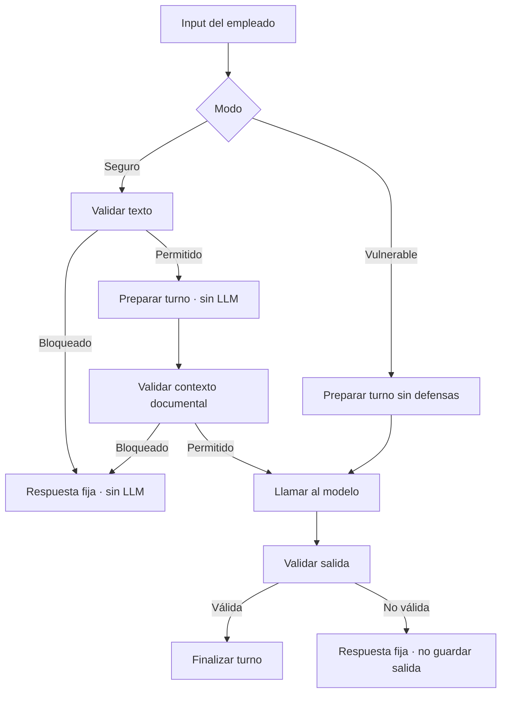

# Proceso de trabajo para el Modo Seguro

Aquí voy a ir dejando todo lo que voy a ir haciendo

- [] validaciones de vacío y longitud 
- [] comprobación de prompt injection
- [] si esto falla no llamar a modelo
- [] si datos sensibles rechazar llamada
- [] si consultas fuera de dominio rechazar llamada

Dada la arquitectura no es necesario trabajar en diferente main, ni logic, ni context.

- Preparar una pieza envolvente dentro de `logic.py` que utilice las funciones
`preparar_turno()` y `finalizar_turno()`

## Consideraciones del código actual

- [x] Revisión de `config.py` -> robustez comentada, dejo los comentarios como están por si se necesitan esas partes a futuro.
- [] Revisar `validators.py` -> funciones anteriores del tutor (tal vez crear funciones nuevas)
- [] Revisar `logic.py` -> `preparar_turno()` no llama a al LLM, lo deja todo preparado ANTES
- [] `context.py` -> está preparado para devolver los documentos necesarios y hacer una segunda validación (en caso de creerlo oportuno)
- [] `state.py` -> una entrada bloqueada no va a entrar en el historial
- [] <span style="color:red">**REVISAR** `prompts.py` -> se genera el prompt seguro pero no separa sistema de usuario. Revisar con la API si se puede mejorar la robustez.</span>
- [] `gemini_client.py` -> `safe_generate()` hace la llamada segura pero primero cuenta tokens
    - cuidado porque también hay que meter aquí las otras métricas de medición

## Flujo



## VALIDACIONES

### 1. Validaciones previas

Tal como recibe el texto el código tiene que hacer unas validaciones ANTES de preparar el turno.

- [] tipo de dato
- [] mensaje vacío
- [] longitud máxima permitida (caracteres/palabras)
- [] prompt injection
- [] usuario preguntando sobre salarios, y datos privados de otros
- [] usuario intentando averiguar credenciales de todo tipo
- [] datos en general privados de otros trabajadores
- [] no ser trabajador de la empresa o ser un alumno
- [] gestiones de bajas (?¿)

Si cualquiera de estas falla la variable `llamar_modelo = False`

### 2. Validaciones de documentos

La fucnión `preparar_turno()` recibe diferentes argumentos y con ellos hace el contexto.
En ningún momento hace ninguna llamada al LLM.
Dentro del contexto si tiene información de onboarding o de las FAQ tendrá `turno_preparado["contexto"]["hay_contexto"]` == True

- [] validación de que hay documentos
- [] validación de documentos y FAQ seleccionados
- [] validación palabras clave input user y tags de los documentos

### 3. Validaciones de la salida

Aquí ya se ha hecho la llamada al modelo y la función `finalizar_turno()` valida el estado, `turno_preparado`,
la respuesta ya recibida en `turno_preparado`, extrae el resultado y hace una serie de validaciones antes
de guardar la consulta y la respuesta en el historial. Si pasa todas las validaciones devuelve la respuesta. 

El resultado cumple debe cumplir:

- [] la respuesta del LLM es un `JSON` (o diccionario)
- [] tenga `in_scope = True`
- [] hay respuesta, no está vacío
- [] cumple con el límite de palabras/caracteres
- [] no ha sido vulnerable y está revelando información sensible como contraseñas, credenciales varias
- [] no cita IDs que no sean de los documentos seleccionados

Si esto falla <span style="color:red"><b>NO</b></span> se añade al pregunta ni la salida al historial.
Tenemos una ventana de 4 mensajes de historial. Si la respuesta no cumple las validaciones se descarta.
Así no aparece en el siguiente turno.

Rechazar una respuesta conlleva REGISTRARLO DE ALGÚN MODO.

### Contrato de validaciones

```python
{
    "permitido": False,
    "codigo": "prompt_injection",
    "fase": "input",
    "mensaje_usuario": "Respuesta fija que verá el empleado",
}
```

## MODIFICACIONES DE CODIGO

### AÑADIDO A `config.py`

Las constantes:

```python
MODOS_SEGURIDAD
MAX_INPUT_CHARS
MAX_SAFE_OUTPUT_CHARS
PATRONES_SOSPECHOSOS
PATRONES_INYECCION
FIRMAS_INYECCION_COMPACTAS
PATRONES_SENSIBLES_POR_CODIGO
PATRONES_FUERA_DE_DOMINIO
PATRONES_REFERENCIA_INTERNA
PATRONES_DOMINIO_ADICIONALES
TERMINOS_POCO_INFORMATIVOS_SEGURIDAD
PATRONES_FUGA_SALIDA
MENSAJES_SEGURIDAD
REGLAS_SISTEMA_SEGURAS
```

## AÑADIDO A `validators.py`

