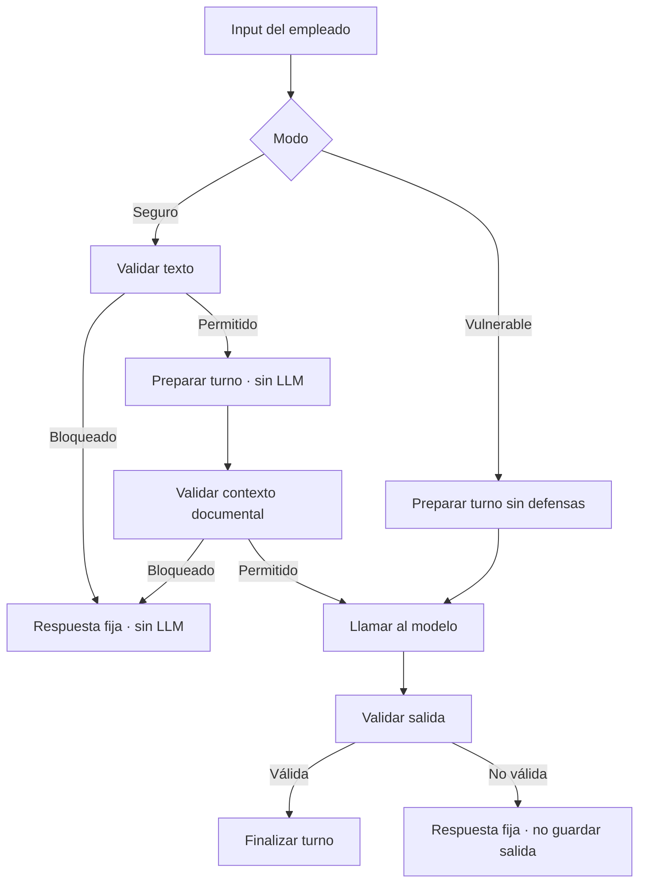

# Proceso de trabajo para el Modo Seguro

Aquí voy a ir dejando todo lo que voy a ir haciendo

- [] validaciones de vacío y longitud 
- [] comprobación de prompt injection
- [] si esto falla no llamar a modelo
- [] si datos sensibles rechazar llamada
- [] si consultas fuera de dominio rechazar llamada

Dada la arquitectura no es necesario trabajar en diferente main, ni logic, ni context.

- Preparar una pieza envolvente dentro de `logic.py` que utilice las funciones
`preparar_turno()` y `finalizar_turno()`

## Consideraciones del código actual

- [x] Revisión de `config.py` -> robustez comentada, dejo los comentarios como están por si se necesitan esas partes a futuro.
- [x] Revisar `validators.py` -> funciones anteriores del tutor (tal vez crear funciones nuevas)
- [] Revisar `logic.py` -> `preparar_turno()` no llama a al LLM, lo deja todo preparado ANTES
- [] `context.py` -> está preparado para devolver los documentos necesarios y hacer una segunda validación (en caso de creerlo oportuno)
- [] `state.py` -> una entrada bloqueada no va a entrar en el historial
- [] <span style="color:red">**REVISAR** `prompts.py` -> se genera el prompt seguro pero no separa sistema de usuario. Revisar con la API si se puede mejorar la robustez.</span>
- [] `gemini_client.py` -> `safe_generate()` hace la llamada segura pero primero cuenta tokens
    - cuidado porque también hay que meter aquí las otras métricas de medición

## Flujo



## VALIDACIONES

### 1. Validaciones previas

Tal como recibe el texto el código tiene que hacer unas validaciones ANTES de preparar el turno.

- [x] tipo de dato
- [x] mensaje vacío
- [x] longitud máxima permitida (caracteres/palabras)
- [x] prompt injection
- [x] usuario preguntando sobre salarios, y datos privados de otros
- [x] usuario intentando averiguar credenciales de todo tipo
- [x] datos en general privados de otros trabajadores
- [x] no ser trabajador de la empresa o ser un alumno
- [x] gestiones de bajas, ambigüedad

Si cualquiera de estas falla la variable `llamar_modelo = False`

### 2. Validaciones de documentos

La función `preparar_turno()` recibe diferentes argumentos y con ellos hace el contexto.
En ningún momento hace ninguna llamada al LLM.
Dentro del contexto si tiene información de onboarding o de las FAQ tendrá `turno_preparado["contexto"]["hay_contexto"] == True`

- [x] validación de que hay documentos
- [x] validación de documentos y FAQ seleccionados
- [x] validación palabras clave input user y tags de los documentos

### 3. Validaciones de la salida

Aquí ya se ha hecho la llamada al modelo y la función `finalizar_turno()` valida el estado, `turno_preparado`,
la respuesta ya recibida en `turno_preparado`, extrae el resultado y hace una serie de validaciones antes
de guardar la consulta y la respuesta en el historial. Si pasa todas las validaciones devuelve la respuesta. 

El resultado cumple debe cumplir:

- [x] la respuesta del LLM es un `JSON` (o diccionario)
- [x] tenga `in_scope = True`
- [x] hay respuesta, no está vacío
- [x] cumple con el límite de palabras/caracteres **REVISAR** -> `validar_salida_segura()` bloque de respuesta
- [x] no ha sido vulnerable y está revelando información sensible como contraseñas, credenciales varias
- [x] no cita IDs que no sean de los documentos seleccionados

Si esto falla <span style="color:red"><b>NO</b></span> se añade al pregunta ni la salida al historial.
Tenemos una ventana de 4 mensajes de historial. Si la respuesta no cumple las validaciones se descarta.
Así no aparece en el siguiente turno.

Rechazar una respuesta conlleva REGISTRARLO DE ALGÚN MODO.

### Contrato de validaciones

```python
{
    "permitido": False,
    "codigo": "prompt_injection",
    "fase": "input",
    "mensaje_usuario": "Respuesta fija que verá el empleado",
}
```

## MODIFICACIONES DE CODIGO

### AÑADIDO A `config.py`

Las constantes:

```python
MODOS_SEGURIDAD
MAX_INPUT_CHARS
MAX_SAFE_OUTPUT_CHARS
PATRONES_SOSPECHOSOS
PATRONES_INYECCION
FIRMAS_INYECCION_COMPACTAS
PATRONES_SENSIBLES_POR_CODIGO
PATRONES_FUERA_DE_DOMINIO
PATRONES_REFERENCIA_INTERNA
PATRONES_DOMINIO_ADICIONALES
TERMINOS_POCO_INFORMATIVOS_SEGURIDAD
PATRONES_FUGA_SALIDA
MENSAJES_SEGURIDAD
REGLAS_SISTEMA_SEGURAS
```

## AÑADIDO A `validators.py`

- imports necesarios
- función para normalizar texto `normalizar_texto_seguridad()`
- funciones auxiliares internas 
- Capa 1. Validación del input
- funciones auxiliares para los documentos
- Capa 2. Validaciones de onboarding y faq
- Capa 3. Validación de la respuesta del modelo.

## AÑADIDO A `logic.py`

Añadidas las variables `MODO_SEGURIDAD_DEFAULT` y `MODOS_SEGURIDAD` en el import de `config`.

Import de `validar_contexto_seguro()`, `validar_entrada_segura()` y `validar_salida_segura()` desde `validators`

Se añade una sección para implementar la capa robusta y de seguridad en la que hay 4 funciones:

- Función privada `_registrar_evento_seguridad()` que se encarga de añadir una clave al diccionario del estado de la sesión `eventos_seguridad` que es una lista en la que se añade cada evento como diccionario. Se registra la `fase` dentro del proceso, el `código` de la incidencia (de entre `MENSAJES_SEGURIDAD.keys()`) y la `longitud_consulta`. No se guarda el input del usuario ya que puede ser que estemos almacenando un ataque o información confidencial filtrada.
- Función `crear_respuesta_controlada()`. Al bloquearse un input antes de hacer la llamada al modelo se le devuelve al usuario un mensaje en función del motivo por el que ha sido bloqueado. Adapta el diccionario de todo el flujo a otro diseño en el que se maneja información necesaria para mostrar al usuario y dar el permiso para poder hacer, o no, la llamada al modelo. También se puede bloquear la respuesta que da el modelo por diferentes motivos y esta función es la encargada de transformar el diccionario para dar el mensaje al usuario.
- Funciones para preparar y finalizar turno. Ya están en la lógica como `preparar_turno()` y `finalizar_turno()`, pero se les añade una función envolvente para poderlo con diferentes modos (seguridad activada o no). `preparar_turno_con_modo()` recibe la información necesaria y utiliza las funciones de validaciones para comprobar el input del usuario y el contexto antes de hacer la llamada. Estas validaciones sin la seguridad activa directamente se las salta y se queda únicamente con las validaciones básicas. `finalizar_turno_con_modo()` envuelve a `finalizar_turno()` para validar la respuesta antes de mostrársela al usuario. En modo vulnerable no hace esa validación extra.

## AÑADIDO A `prompts.py`

- build_secure_prompt
- build_secure_system_instruction
- build_secure_turn_contents

## AÑADIDO A `gemini_client.py`

- safe_generate_with_system_instruction

## ADAPTACIONES EN `main.py`

- Cambios en `ejecutar_sesion()` para utilizar las funciones envolventes de preparar y finalizar turno.
- demo_vulnerable_vs_seguro -> funición para ejecutar llamada con ambos modos en las mismas condiciones.

## COMO FUNCIONA CADA MODO

### Modo vulnerable

El modo vulnerable es deliberadamente inseguro, pero conserva la arquitectura común:

1. recibe la misma consulta;
2. llama a `preparar_turno()`;
3. omite `validar_entrada_segura()` y `validar_contexto_seguro()`;
4. devuelve `llamar_modelo = True` incluso si el contexto está vacío o la consulta es sensible;
5. el adaptador utiliza `build_vulnerable_prompt()`;
6. no aplica la puerta de salida.

No debe inventarse una vulnerabilidad absurda como incluir una contraseña real. El fallo demostrable es confiar en la entrada, mezclarla con las instrucciones y enviar preguntas no autorizadas al modelo.

### Modo seguro

1. valida antes de preparar;
2. prepara sin LLM solo cuando el texto supera la primera puerta;
3. comprueba que las fuentes seleccionadas sostienen el tema;
4. devuelve mensajes fijos ante un bloqueo;
5. llama a Gemini solo con `llamar_modelo is True`;
6. separa `system_instruction` de `contents`;
7. valida la respuesta antes de guardarla.

### Quién puede elegir el modo

El empleado no debe poder escribir un comando para cambiar a vulnerable. `MODO_SEGURIDAD_DEFAULT` debe quedar en `"seguro"`. El modo vulnerable solo se pasa explícitamente desde una demo o una prueba controlada.

## CREADO `casos_trampa.json`

## Riesgos y límites reales

### No existe una expresión regular que bloquee toda inyección posible

La petición “evitar cualquier tipo de prompt injection” no puede garantizarse matemáticamente solo con una lista de frases. Un atacante puede usar sinónimos, otros idiomas, caracteres homógrafos, texto codificado o instrucciones indirectas.

La defensa propuesta es por capas:

1. patrones y normalización Unicode;
2. allowlist de dominio;
3. selección limitada de contexto;
4. rechazo de información no documentada;
5. separación real mediante `system_instruction`;
6. ausencia de secretos y herramientas peligrosas en el prompt;
7. validación de salida;
8. pruebas adversarias repetibles.

Para el Team Challenge cubre de forma determinista las categorías exigidas. Para producción habría que añadir autenticación, autorización por rol, control de acceso a documentos, rate limiting, observabilidad, revisión periódica de falsos positivos y pruebas de red team.

### Regex no sustituye al control de acceso

Aunque el empleado formule una pregunta interna, no debería recibir automáticamente cualquier documento interno. El proyecto actual solo selecciona documentación común de onboarding. Si en el futuro se añaden documentos restringidos por departamento, `context.py` deberá filtrar primero por permisos del empleado y después por relevancia.

### Los filtros de seguridad del proveedor no resuelven este dominio

Los filtros generales de contenido del modelo están orientados a categorías de daño. No sustituyen las reglas empresariales de salario, credenciales, participantes externos o políticas no documentadas. Esas decisiones deben permanecer en Python.

## PROCESO DE IMPLEMENTACION

La implementación puede considerarse terminada cuando se cumpla todo lo siguiente:

- [x] El modo por defecto es `seguro`.
- [x] El usuario final no puede activar el modo vulnerable.
- [x] Una entrada vacía no llega a `count_tokens()`.
- [x] Una inyección no llega a `count_tokens()` ni a `generate_content()`.
- [x] Salarios, bonus, nóminas y credenciales reciben respuestas fijas.
- [ ] Un participante externo recibe la derivación correcta.
- [ ] Una política sin apoyo documental no se inventa.
- [ ] La baja ambigua explica los dos caminos sin mezclarlos.
- [ ] Una entrada bloqueada no entra en `state["messages"]`.
- [x] El prompt seguro utiliza como máximo tres documentos y dos FAQ.
- [ ] Sistema y usuario se envían por canales separados del SDK.
- [ ] La salida no puede citar fuentes ajenas al contexto seleccionado.
- [ ] Los cinco casos propios prueban `llamar_modelo == False`.
- [ ] El mismo input, en vulnerable, prueba `llamar_modelo == True`.
- [x] No existen `main_seguro.py`, `main_vulnerable.py`, `logic_seguro.py` ni `logic_vulnerable.py`.